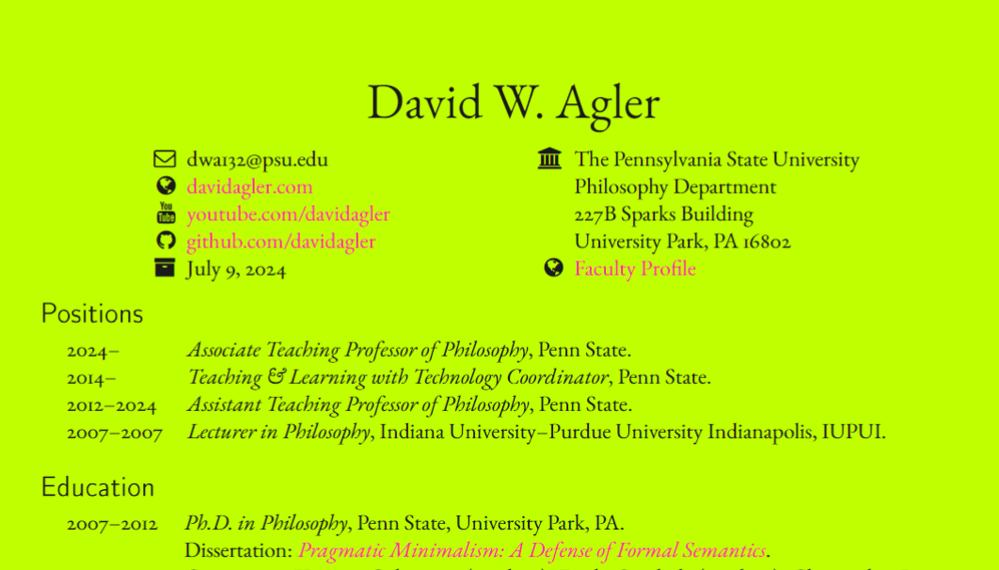
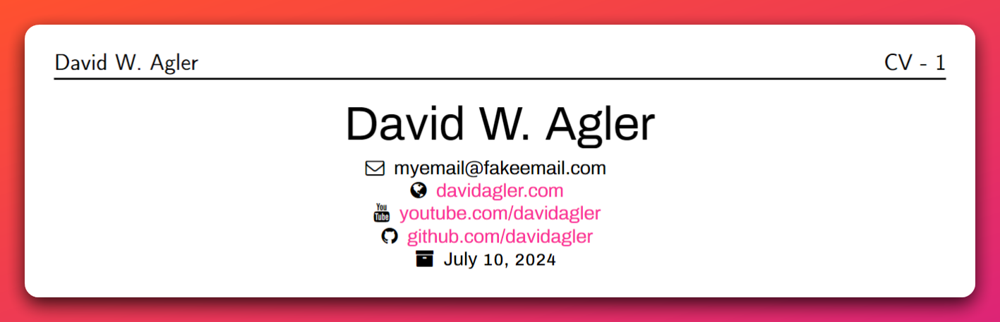
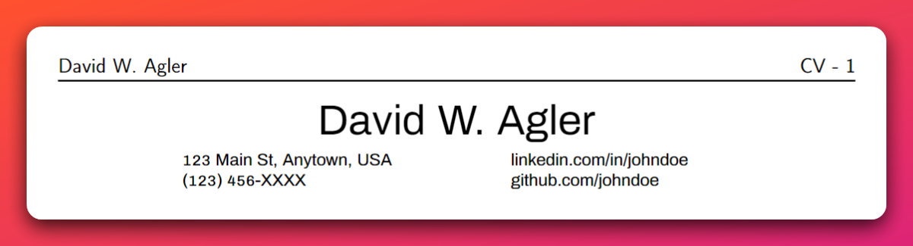

# LightCV

LightCV is a LaTeX class for creating a simple CV or resume. It is based on the article class, with additions for a CV. There are several good (and probably better) CV classes and packages available. Some include: [biblatex-cv](https://ctan.org/pkg/biblatex-cv), [cv](https://ctan.org/pkg/cv), [EuropeCV](https://ctan.org/pkg/europecv), [moderncv](https://ctan.org/pkg/moderncv?lang=en), [currvita](https://ctan.org/pkg/currvita), [simplecv](https://ctan.org/pkg/simplecv), [readablecv](https://ctan.org/pkg/readablecv), and [mycv](https://ctan.org/pkg/mycv). All are worth checking out. 

I created this class for two reasons: (1) I wanted a super simple way to make my cv and (2) I wanted to try to see how $\LaTeX$ classes worked (this is my first $\LaTeX$ class).

## Usage

The class is used like any other $\LaTeX$ class. Take the `lightcv.cls` and put it in the same directory as your `.tex` file. Then add `\documentclass{lightcv}` to the top of your main `.tex` file.


## Options

Since the `lightcv` is based on the article class, it accepts the same options. The following are two common options:

- `11pt` or `12pt` - Font size
- `letterpaper` or `a4paper` - Paper size

In addition, the `lightcv` class accepts an option based on whether you want a header on the first page. This is the `p1header` option. The default is to not have a header on the first page.

```latex
- \documentclass{lightcv} % No header on first page
- \documentclass[p1noheader]{lightcv} % No header on first page- 
- \documentclass[p1header]{lightcv} % Header on first page
```

LightCV has various styles or "modes". The basic ones are `darkmode` and `lightmode` (default `lightmode`). Using `darkmode` changes the page color to black and the text to gray.


```latex
\documentclass[darkmode]{lightcv}
```


There are plenty of other modes to play around with (some of which are hideous). Here is `limemode`:



The different modes are defined at the beginning of the `lightcv.cls` file (I'm not sure if all of them work properly). If you create one that looks good, I'm happy to add it.

Some of the `article` class options are not compatible with the `lightcv` class. For example, `twocolumn` will produce an error message since the `lightcv` class is not designed for two columns.

## Commands and Environments

The `lightcv` class provides several environments and commands for creating a CV. Let's consider each.

### Author and Contact Information

`\author{}`: Sets the author's name, which is used in the header and in the contact information section.

This should be set in the preamble as follows:

```latex
\author{John Doe}
```

`\ContactInfo[int][1st_col][2nd_col]`: Creates a multi-column contact information section. The first column is an integer "1 or 2" that specifies the number of columns you would like under your name. Each column consists of itemized lists of contact details. Each row of the contact details is created using the `\crow[]{}` command. The optional argument is the contact detail type / label. The mandatory argument is the contact detail. The `\crow` command can be used multiple times to create multiple rows of contact details.

The `\ContactInfo[][]` should be used after the `\begin{document}` command as follows:

```latex
% One column of contact details
\ContactInfo[1][
    \crow[]{123 Main St, Anytown, USA}
    \crow[]{(123) 456-XXXX}
]
```

Here is a simple example of a single column:

```latex
\documentclass{lightcv}
\author{David W. Agler}
\begin{document}
\ContactInfo[1][
\crow [\faEnvelopeO] myemail@fakeemail.com
 \crow[\faGlobe]  \href{www.davidagler.com}{davidagler.com}
 \crow[{\faYoutube}] \href{https://www.youtube.com/davidagler}{youtube.com/davidagler}
 \crow[\faGithub] \href{https://www.github.com/davidagler}{github.com/davidagler}
 \crow[\faArchive] \today
]
\end{document}
```



Here is an example that contains two columns:

```latex
% Two columns of contact details
\ContactInfo[2][
    \crow[]{123 Main St, Anytown, USA}
    \crow[]{(123) 456-XXXX}
][
    \crow[]{linkedin.com/in/johndoe}
    \crow[]{github.com/johndoe}
]
```




For two columns, the margins are set using the `\contactleftmargin` and `\contactrightmargin` lengths. The `\contactsep` length determines the space between the left and right columns of the contact details section. You can customize these lengths by using the `\setlength` command:

```tex
\setlength{\contactleftmargin}{2em} % adjust this value as needed
\setlength{\contactrightmargin}{2em} % adjust this value as needed
\setlength{\contactsep}{1em} % adjust this value as needed
```

Personally, I like using [fontawesome icons](https://ctan.org/pkg/fontawesome?lang=en) for the labels of the contact details. The following replaces the labels with fontawesome icons:

```latex
\ContactInfo[1][
    \crow[\faHome]{123 Main St, Anytown, USA}
    \crow[\faPhone]{(123) 456-XXXX}
    \crow[\faEnvelopeO]{john.doe@example.com}
]
```

In the future, I plan to implement a command that will allow to specify add a third column.

### Header Information

The header is defined in the `lightcv.cls` file using the following:

```latex
\newcommand{\lightheadertitle}[1][CV]{#1}
\newcommand{\lightheadersep}[1][-]{#1}
\fancyhead[L]{\large \sffamily \storedauthor}
\fancyhead[R]{\large \sffamily \lightheadertitle\ \lightheadersep\ \thepage}
```

You can tinker with this by replacing "CV", the separator "-", or replacing `\thepage`. Another option is to add the date.

### The Dated Environment

The `dated` environment can be used as follows:

```latex
\begin{dated}[title]
    date-date & details \\
    date-date & details \\
    date-date & details \\
\end{dated}
```

The dated environment takes an optional environment that is used as the section title. The default is "Employment". The environment creates a section title using `\section*` and then makes use of the `longtable` environment to create a two column table. The first column is set as left-aligned, but the width of the second column is set using a length titled `\details`: This length determines the width of the second column of the `longtable` in the `dated` environment. You can customize this length by using the `\setlength` command:

```tex
    \setlength{\details}{0.75\textwidth} % adjust this value as needed
```

Since the environment is just a table with a section, you could use the environment in a different way. For example, you could set the section title to "Student Comments" and use the environment to create a table of student comments. The following is an example:

```latex
\begin{dated}[Student Comments]
    Class & Student comment \\
    Class & Student comment \\
    Class & Student comment \\
\end{dated}
```

Alternatively, you can avoid using this environment and use the `section*` command and `longtable` environment directly.

### The rlist Environment

The `rlist` or "reverse list" environment can be used as follows:

```latex
\begin{rlist}[title][type]
    \item details \\
    \item details \\
    \item details \\
\end{rlist}
```

The `rlist` environment takes two optional arguments. The first is the section title, which defaults to "Publications". The second is the list type, which defaults to "etaremune". This is a reverse enumerated list. If there are 12 items in the list, it will count 12, 11, 10. Here is an example from my CV:

```latex
\begin{rlist}[Publications]
    \item Pollock, R. \& Agler, D. W. (2016). Article Details.
    \item Agler, D. W. \& Stango, M. (2015). Article Details.
\end{rlist}
```

If you need a different type of list, you can specify that the `rlist` environment uses the `enumerate` environment. For example, the following creates a regular enumerated list:

```latex
\begin{rlist}[title][enumerate]
    item & details \\
    item & details \\
    item & details \\
\end{rlist}
```

The environment makes use of the `rlistleftmargin` length, which determines the left margin of the enumerated list in the `rlist` environment. You can customize this length by using the `\setlength` command in your document:

```latex
\setlength\rlistleftmargin{2em} % adjust this value as needed    
```

### The Catsec Environment and Related Commands

The `catsec` environment is useful for putting the `catbox` and `catlist` commands. The environment is used as follows:

```latex
\begin{catsec}[title]
 % Stuff
\end{catsec}
```

Its only creates a `section*` title and then adds some vertical space below the environment. So, the environment's only use is probably to group the `catbox` and `catlist` commands.

The `catbox` command can be used as follows:

```latex
\catbox{Category}{details}
```

It creates two minipages with the first being a one with category name and the second being one with the details. The two minipages are separated using `\catsep`. So, for example, the following creates a category titled "Languages" with the details "Python, HTML, CSS, JavaScript, \LaTeX":

```latex
\begin{catsec}[Skills]
\catbox{Languages}{Python, HTML, CSS, JavaScript, \LaTeX}
\catbox{Frameworks}{Flask, React, Angular}
\catbox{Databases}{MySQL, PostgreSQL, MongoDB}
\end{catsec}
```

Finally, `\catlist{left}{right}` is similar to catbox in that it creates two minipages separated by `\catsep`, but the second column is a itemized list. The following is an example:

```latex
\begin{catsec}[Powers]
    \catlist{Super}{
        \item Flight
        \item Telepathy
        \item Telekinesis}
    \catlist{Normal}{
        \item Running
        \item Biking
        \item Swimming}
\end{catsec}
```

## Templates

For examples / templates of how to use the `lightcv` class, see the `examples` directory in [the GitHub repository](https://github.com/davidagler/lightcv).
